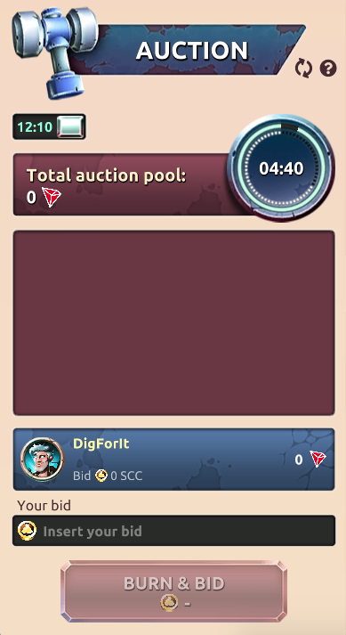

  

To win in Auction you should place bids with SCC token. Every new auction will end when the timer goes to zero. With the timer switch you can see the result of the previous round.

The DIG winning pool is 1% of the total bets placed on the platform.

[auction-table](../_data/auction-table.md ':include')
