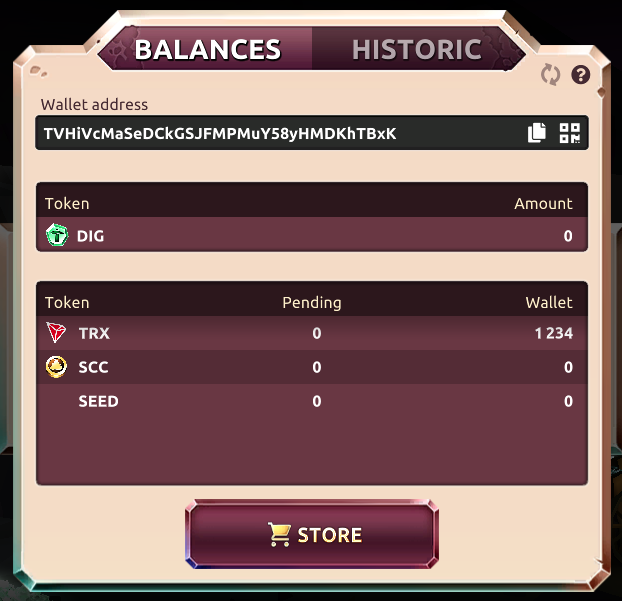
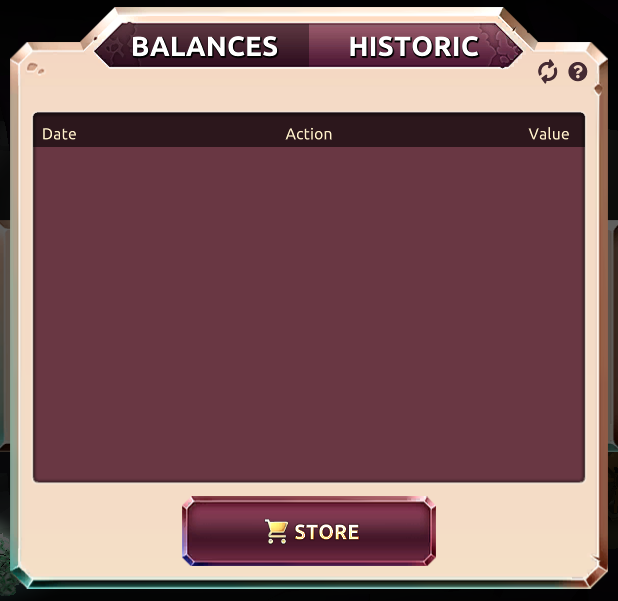

 

In the BANK section you can see your tokens you have on the platform in your personal wallet. The tokens are all in your wallet, so owned by you. The tokens (link to tokens.md) we have are DIG, TRX, SCC and future partner tokens. The tokens you win in the game are summarised and will be placed in the pending queue. When you reach a minimum for withdrawal of tokens then it will be withdrawn automatically to your wallet. Here is the withdrawal table:

[withdrawal-table](../_data/withdrawal.md ':include')

 

In the historic section of the bank you can see historics of your bets and other actions. Here you can check the [provably fairness](./provably.md "provably") of your bets too.

