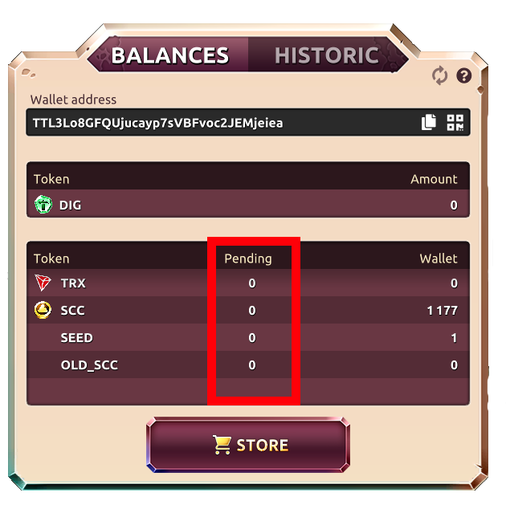
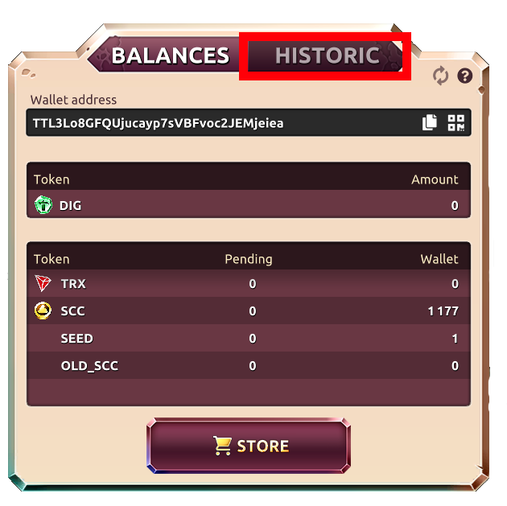


**WALLET ADDRESS:**

Your wallet address is the current address that is linked to your TronLink or the private key entered to access the platform. You are able to deposit funds into your wallet address by using the "Copy" function or the QR code beside the displayed address.

**Pending:**

This means the displayed token amount has not yet been sent from the sever to the wallet address via the blockchain. 10 TRX or 1 SCC is the minimum. As soon as your pending amount equals the minimum, your tokens are sent to your wallet. 

**History:**

The history tab displays all your past transactions that have happened from your account. This is your "go-to" place to troubleshoot any issues with any misplaced funds. If you are still having trouble, then you should message us through our telegram.

**Token Amounts:**

This is the amount of tokens in your wallet that are recognized by the DIG for IT platform. These numbers will increase as you earn rewards within the platform. These are the amounts of tokens that are currently on blockchain in your registered TRX wallet. 

