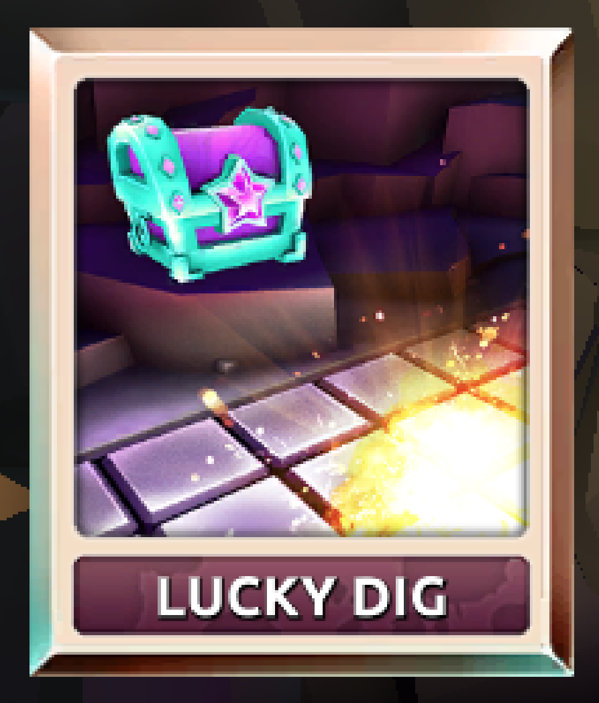
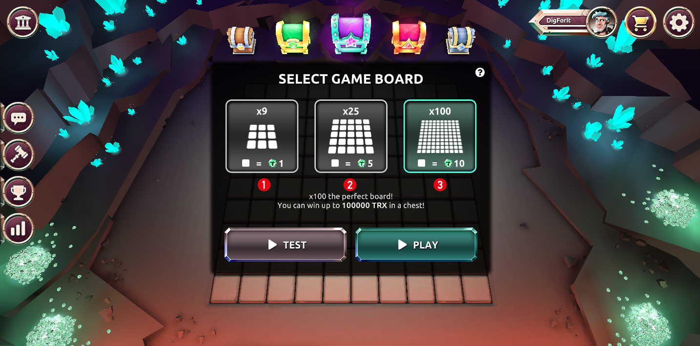
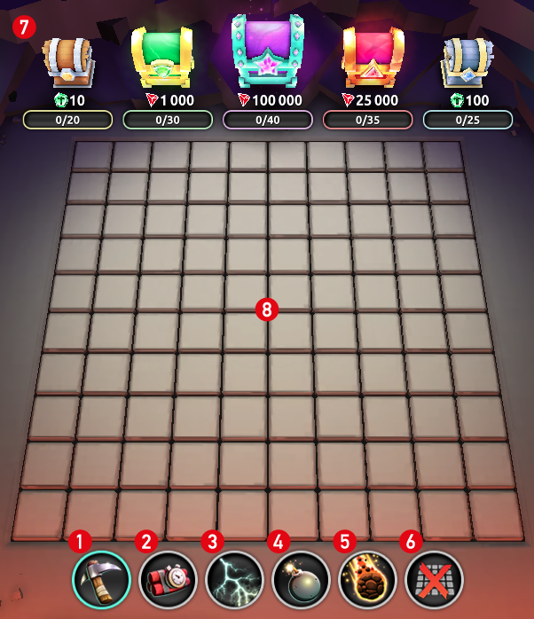
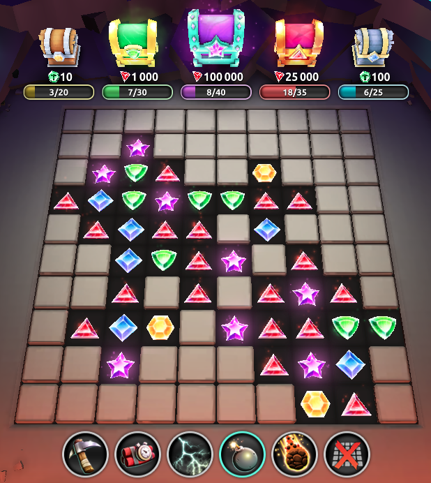

**Description**
 
Discover the world of LUCKY DIG. Find gems under the tiles to open up the big chests for amazing rewards. You can even get extra rewards by digging gems and you will also mine SCC.

**How to play?**

When you enter the game  you put into the LUCKY DIG map. Here you can select 3 types of boards for playing : 
Gameboard 9 tiles (cost 1 DIG / tile) 
Gameboard 25 tiles (cost 5 DIG / tile) 
Gameboard 100 tiles (cost 10 DIG / tile) 

After you have selected the board you want to play then hit PLAY

After hitting the PLAY button you come into the game board (8).
You have tools (1-6) at the bottom of the screen to DIG the tiles
The gems you DIG up from the board will be saved in the chests at the top of the board. When you have filled a chest you get the prize for that specific chest when the map is completely dug or you close the current map.

With evert DIG action, you have the chance of digging up extra tokens like [TRX](./trx.md "trx"), [SCC](./scc.md "scc") or [DIG](./dig.md "dig"). You also mine SCC with every dig as well! The higher [level](./levels.md "level") you are the more SCC you mine.

With every new game board the chests and map are reset.

   

1. Hammer DIG 1 tile
2. Timebomb  DIG 5 tiles
3. Lightning DIG a random tile
4. Bomb DIG 13 tiles
5. Armageddon DIG 50% of the tiles
6. Close game board
7. Treasures with the gems you dug in the map
8. DIG Game board

[Prizes Table](../_data/map/prizes-table.md 'prizes-table')
[Gems Table](../_data/map/gems-table.md 'gems-table')
