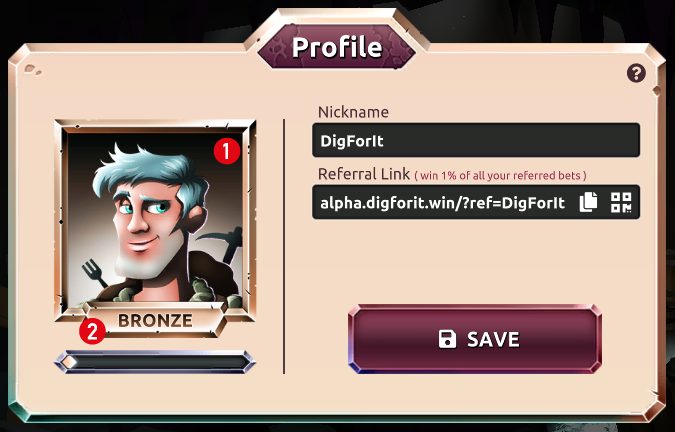

1. Avatar : You can choose your own avatar
2. Level : this is the current level you are at the moment. [(more info)](./levels.md "levels")

When you have logged in, you get your personal profile. In that profile screen you can edit your NICKNAME.  Your referral link is the same as your nickname, this one can’t be edited different then your Nickname.   
Every referral link gets 1% of the total bets of the player that uses your referral.
