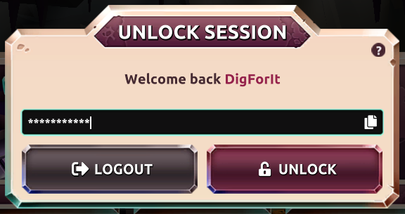

Your session will be encrypted with the password you provide in case you select to do so. Each time you login that password will be required in case you provided that in the past. The session password is important cause it encrypts your data (included your PK if you logged in with it), then we encourage to put one but don't force to do it.

