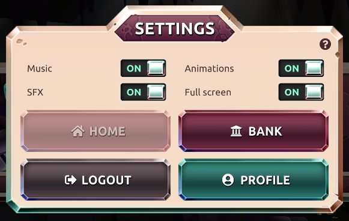

The settings screen has basic functions you can turn on or off. The platform uses music, sound effects (SFX) and animations. To have the best experience we recommend to turn on the full screen. Through this settings screen you have access to the [BANK](./bank.md "bank") and to your personal [PROFILE](./profile.md "profile"). When you want to logout of your session you can use the LOGOUT button.

