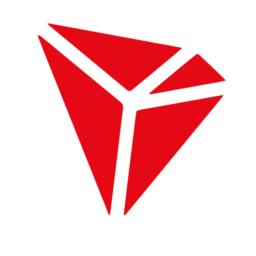

**TRX TOKEN**

TRX is the primary token on the TRON blockchain. It is a 6 decimal token that can be bought and traded on most cryptocurrency exchanges. TRX can be bought using most government issued currencies, with current price of TRX and listed exchanges available [here](https://coinmarketcap.com/currencies/tron/). 

TRX is used by the "DIG for IT!" platform for purchasing DIG tokens and the pairing for the price of the primary token of the platform, SCC. 
