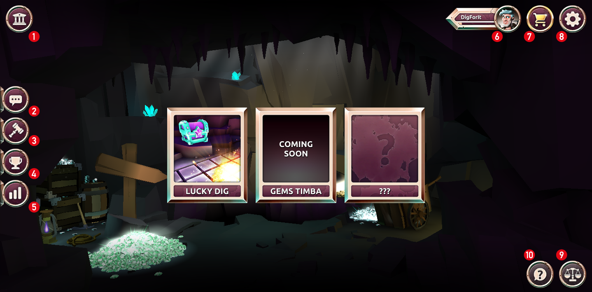

  

Welkom bij het DIG-platform! We bieden je de meest spectaculaire games op de TRON-blockchain.
Wat kunt u van ons verwachten en wat maakt het DIG-platform uniek? 

We bouwen onze games in Unity3D voor maximale game-ervaring. Dit geeft ons de mogelijkheid om onze games aan te bieden op mobiele apparaten en Mac / pc-platforms. 
Ons doel is om een duurzaam gamingplatform te ontwikkelen en uit te breiden. Om deze reden heeft het team een community die helpt bij het verbeteren van elk aspect van het platform en de mogelijke games. Word lid van onze community, vertel ons je ervaring en hoe we deze kunnen verbeteren.  

De geavanceerde tokenomische strategie is uniek en solide. Spelers en supporters laten genieten op een <a href="https://medium.com/@digforit/scc-buy-back-and-burn-2b578932589f" target="_blank"> uniek </a> manier.  
 
Kwaliteit staat op nummer 1 bij het DIG-team! Overtuig uzelf en word lid van onze community. Je kunt onder andere TRX en tokens zoals SCC minen en verkrijgen door de games te spelen! Je kunt tokens winnen met onze veiling en/of de beste te zijn in het klassement. Ervaar zelf de blockchain games van het 'volgende niveau'! Game on!  

Happy Digging  
 
 
**Informatie van DigForIt**
 
Home: https://digforit.win 
Telegram: https://t.me/DIGforIT 
Twitter https://twitter.com/DIGforITGameHub 
Medium: https://medium.com/@digforit 
Docs: https://docs.digforit.win 
Support: support@digforit.win 
 
  
**Start scherm**

1. Bank : informatie over uw token balans [(meer info)](./bank.md "bank")
2. Chat : basis chat om te praten met andere spelers [(meer info)](./chat.md "chat")
3. Veiling : bied met SCC om een deel van de winsten te winnen [(meer info)](./auction.md "auction")
4. Klassement : een klassement met de beste spelers van het platform [(meer info)](./tournament.md "tournament")
5. Statistieken : algemene statistieken van het platform [(meer info)](./statistics.md "statistics")
6. Profiel : jouw perosonlijke profiel en level [(meer info)](./profile.md "profile")
7. Winkel : koop en verkoop DIG om op het platform te kunnen spelen [(meer info)](./store.md "store")
8. Instellingen : mogelijkheid om platformervaring te veranderen [(meer info)](./settings.md "settings")  
9. Aantoonbare eerlijkheid : basis informatie over de aantoonbare eerlijkheid van het platform [(meer info)](./provably.md "provably")
10. Lees mij : informatie over het platform
