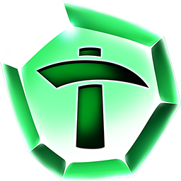

**DIG TOKEN**

DIG is the client sided internal game token created to make on-chain transactions more efficient  and optimize the gameplay for players, by reducing the amount of transactions their TRON wallet will be performing. DIG tokens will need to be purchased before a user is able to play any of the games within the "DIG for IT!" platform, with ONE (1) DIG being equivalent to ONE (1) TRX. These tokens can also be won by players when playing games within the platform, with these won tokens being directly credited to the players account. 

All DIG tokens can be bought and sold via the in-game store. There is a one percent (1%) fee attached to all sell orders of DIG. DIG tokens CANNOT be sent out of the platform and are not active on the TRON blockchain. 
