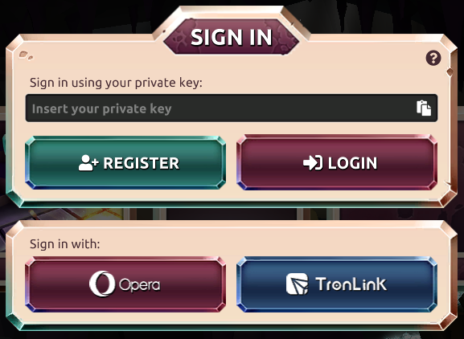

U kunt op verschillende manieren inloggen op het platform. U kunt uw privé sleutel importeren om in te loggen. Opmerking over beveiliging: de privésleutel gaat niet via internet en blijft op uw apparaat staan. Als u geen portefeuille hebt, dan kunt u een nieuwe portefeuille maken met de knop REGISTREREN.  

In Tronlink en andere plug-ins kunt u inloggen via de extensie van de browser. U hoeft dan niet in te loggen met uw privé sleutel, maar u kunt eenvoudig op de TRONLINK-knop drukken om in te loggen in uw sessie op het platform. Na het inloggen wordt u gevraagd om een wachtwoord voor uw [sessies](./ sessions.md "sessies") te maken.

