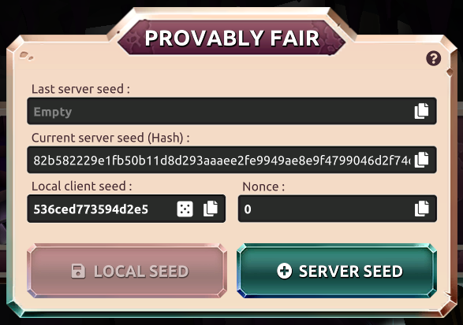

DIG FOR IT implementeert een aantoonbaar eerlijk systeem waarmee spelers de integriteit van elke weddenschap kunnen controleren en bevestigen dat ze niet zijn gemanipuleerd. Willekeurige wed resultaten worden gegenereerd door het gebruik van een server seed, client seed en een nonce. De server seed wordt gehasht en getoond voordat het spel begint. Dit zorgt ervoor dat het wedresultaat niet kan worden gewijzigd tijdens het spel. Twee seeds en de nonce worden gebruikt om een willekeurig wed resultaat te bepalen.  

**Server seed:** Deze seed is uniek en willekeurig gegenereerd door de server. Je kunt het eenmaal per 24 uur wijzigen. 
**Client seed:** Deze seed wordt gekozen door de speler (uzelf) en kan altijd worden gewijzigd. 
**Nonce:** Oplopend aantal om de willekeur van de client / server-seed te waarborgen.  

Elk spelmechanisme kan het resultaat van de weddenschappen controleren in het scherm [Bank Historie](./bank.md "bank" </bank>)

Klik <a href="https://en.wikipedia.org/wiki/Provably_fair" target="_blank">hier</a> om meer te weten te komen over Provably Fair systemen.
